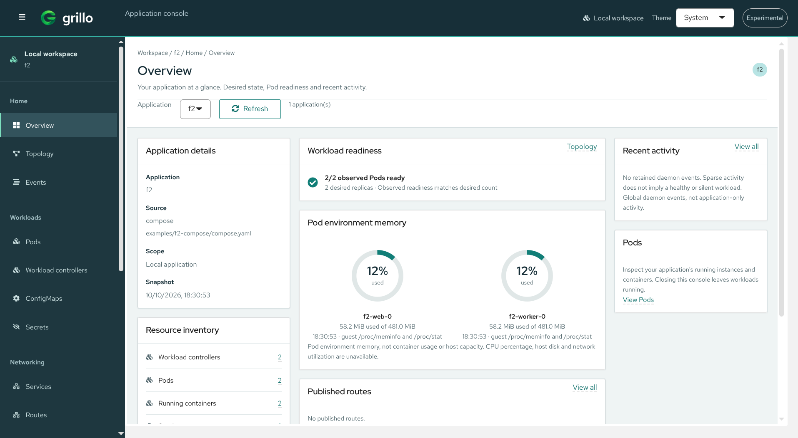

<h1 align="center">
  
</h1>

<p align="center"><strong>Local Kubernetes semantics. No Kubernetes required.</strong></p>

<p align="center">
  <a href="docs/getting-started.md">Getting started</a> ·
  <a href="docs/ui.md">Web console</a> ·
  <a href="docs/compatibility.md">Compatibility</a> ·
  <a href="docs/progress.md">Project status</a>
</p>

Grillo runs local applications in hardware-isolated microVMs. **Compose projects,
Kubernetes manifests and Helm charts compile into one application model.** One
Kubernetes Pod becomes one microVM; its containers share localhost.

The goal is Compose-like ergonomics with production-shaped Pod composition,
service discovery, configuration, storage and probes—without a Kubernetes control
plane, privileged always-on daemon or silent host-container fallback.

## Status

> **Experimental · Linux/amd64 · KVM required**
>
> The runtime has real integration evidence, but there is no packaged release or
> supported runtime version. Product hardening and release preparation remain
> unfinished. Do not use Grillo as a production security boundary.

[Compatibility](docs/compatibility.md) distinguishes supported, degraded and
rejected semantics. [Progress](docs/progress.md) records actual checks and blockers,
not roadmap promises.

## What you can do

- **Apply local applications** from Compose, a Kubernetes subset or local and
  exact-version OCI Helm charts, without a cluster or kubeconfig.
- **Inspect and debug Pods** through the CLI and console: logs, events, container
  exec, an interactive terminal and actual guest/container metrics.
- **Use application services, configuration and persistent data** with explicit
  compatibility diagnostics rather than silent approximations.
- **Keep workloads running independently of the interface.** Closing the CLI or
  browser does not stop applications; the per-user daemon starts on demand.

## Web console



*Overview of the included Compose example. Displayed values are a captured
snapshot, not benchmark results or performance guarantees.*

The console is Pod-oriented: browse workloads, inspect containers and open their
logs or terminal. Topology shows **Services only**, with related Pods in the
inspector. MicroVM details stay in advanced runtime information.

- **Interactive terminal:** direct keyboard input, ANSI colors, alternate screens
  and real PTY resize. [Real Chrome/KVM evidence](docs/experiments/t23-xterm-terminal.md)
  includes editing and saving a file with `vi`; complete OpenShift parity is not claimed.
- **System / Light / Dark:** select a theme manually or follow the browser's
  color scheme automatically.
- **Local by default:** embedded assets, loopback binding and a short-lived,
  one-use bootstrap URL. No CDN or runtime Node service.

See the [console guide](docs/ui.md) for authentication, workflows and limits.

## Start here

Run from a source checkout as your normal user. Build prerequisites are
**Go 1.27.2** (selected patch of Go 1.27.x in `.go-version`), **Node 24.18.0 /
npm 11.16.0**, Python 3 and Make. No automatic Go release-family upgrade.
For a private Go-only setup without replacing system Go, see the
[script guide](scripts/README.md).

```sh
make ui-deps          # explicit integrity-locked frontend download
make build
./bin/grillo version --json
```

**Building binaries does not prepare a runnable host.** You also need KVM/vsock
access, QEMU, virtiofsd, rootless networking tools and verified guest artifacts.
Follow [getting started](docs/getting-started.md) to provision these explicitly
and build the guest. Then, in Bash:

```sh
source scripts/prepare_env.sh
./bin/grillo doctor --verbose
```

The script configures absolute development paths and PATH; it does not install
or build prerequisites. `doctor` is read-only. Resolve reported blockers before
running workloads. Node/npm are build tools, not compiled-runtime dependencies.

Once the host and guest are ready:

```sh
./bin/grillo plan examples/f2-compose/compose.yaml
./bin/grillo up examples/f2-compose/compose.yaml
./bin/grillo status f2
./bin/grillo ui --port 0
```

Open the printed console URL locally; **do not share its bootstrap credential**.
See the [Compose example](examples/f2-compose/README.md) for its services and
persistence. For a fixture/key-free staged prefix, standalone examples and actual
moved/read-only runtime gates, see [runtime layout](docs/runtime-layout.md).
Local staging is not a supported or redistribution-cleared release.

## Everyday use

These examples use repository-relative source paths; runtime artifacts use
absolute development overrides or installed-prefix discovery.

```sh
./bin/grillo ps
./bin/grillo inspect f2
./bin/grillo exec f2 worker -- cat /data/result.html
./bin/grillo events -f
./bin/grillo down f2
```

`down` stops the application but preserves managed volumes. **`down --volumes f2`
explicitly deletes owned managed data**, never host bind paths. Reapplying the
same source is idempotent; changed templates use Recreate, not rolling updates.

### Helm

Explicitly provision **Helm v4.2.2** and set `GRILLO_HELM_BINARY` to its absolute
executable path before using development charts:

```sh
./bin/grillo plan examples/helm/demo --release demo
./bin/grillo up examples/helm/demo --release demo
./bin/grillo down demo
```

[Helm examples](examples/helm/README.md) cover values, OCI charts, explicit fetch
consent and renderer restrictions.

## Design choices and limits

- **One model, shared runtime:** frontends compile into a versioned IR and never
  control VMMs directly. CLI and UI use the same private local API.
- **One Pod, one microVM:** the current execution path uses QEMU `microvm`,
  virtiofsd, a Go guest agent and guest-side runc.
- **Rootless host operations:** no automatic sudo; KVM and namespace access
  still require a suitable host. On the tested Fedora policy, SELinux Enforcing
  blocks pasta helpers. Grillo does not change host security policy.
- **Explicit compatibility:** unsupported fields block execution; accepted
  downgrades require code-specific consent. Compose `depends_on` supports
  started/healthy startup gates, not all dependency conditions or ongoing coupling.
- **Deliberate sharing:** bind mounts expose selected host data. Host-originated
  virtiofs notifications are degraded; use polling.
- **Honest observations:** missing metrics are unavailable, not invented.
  Container usage, guest environment accounting and VMM RSS remain separate.
  Heavy log output can be lost with an explicit guest-retention gap.

No macOS/Windows runtime hosts, GPU, multi-node execution, operators/CRDs,
StatefulSet/Job or TLS/CA setup are claimed. See the
[compatibility matrix](docs/compatibility.md) and
[hardening evidence and remaining gates](docs/experiments/t24-interactive-metrics-artifacts.md).

Hardware isolation is not absolute security. KVM, the VMM, guest, helpers,
filesystem sharing and parsers remain security-critical. Startup and memory
objectives are not performance guarantees.

## Guides

| Start with | For |
| --- | --- |
| [Getting started](docs/getting-started.md) | Host prerequisites, guest build, first application and troubleshooting |
| [Web console](docs/ui.md) | Views, themes, authentication, logs and terminal |
| [Compatibility](docs/compatibility.md) | Compose, Kubernetes and Helm semantics |
| [Architecture](docs/architecture.md) | Runtime, lifetime, storage and networking boundaries |
| [Host evidence](docs/host-support.md) | Tested scopes, support boundaries and safe reporting |
| [Runtime layout](docs/runtime-layout.md) | Experimental runtime-only staging |
| [Testing](docs/testing.md) | Routine checks and real integration gates |
| [Local API](api/local-api.md) · [Guest protocol](api/guest-protocol.md) | Runtime contracts |
| [Contributing](CONTRIBUTING.md) · [Security policy](SECURITY.md) | Contributions and vulnerability reporting |

For design and delivery work, read the [specification](grillo-project-specification.md),
[implementation plan](IMPLEMENTATION_PLAN.md), [ADRs](docs/adr/README.md) and
[current progress](docs/progress.md). Historical reports are evidence, not
prerequisites for everyday use.

## Name and license

<p align="center">
  
</p>

*Grillo* means “cricket” in Italian and evokes the Talking Cricket from Pinocchio:
a small companion that points out incompatibilities. The leaf-G icon identifies
the console; the illustration keeps that companion in view. The name remains
provisional pending naming and trademark review.

Original contributions are [Apache-2.0](LICENSE). See [NOTICE](NOTICE) for
attribution; external tools, guest components, fonts and icons retain their own
licenses.
