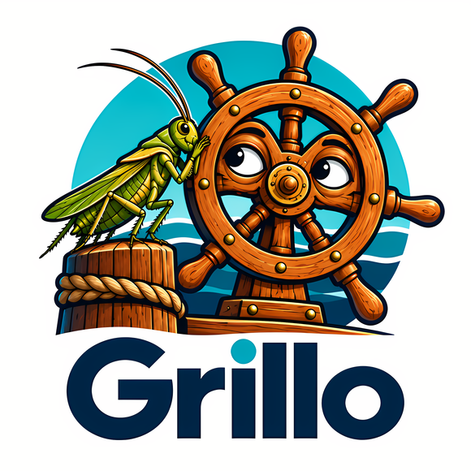

# Grillo

**Local Kubernetes semantics. No Kubernetes required.**

Grillo runs local applications in hardware-isolated microVMs. Compose projects,
Kubernetes manifests and Helm charts compile into one application model. One
Kubernetes Pod becomes one microVM; its containers share localhost.

The goal is Compose-like ergonomics with production-shaped Pod composition,
service discovery, configuration, storage and probes, without a Kubernetes
control plane or privileged always-on daemon.

## Status

Grillo has a working experimental runtime on **Linux/amd64 with KVM**. Compose,
a Kubernetes subset, local/exact-version OCI Helm charts and the web console
have real integration evidence. There is **no packaged release or supported
runtime version**; product hardening and release preparation remain unfinished.
Do not use it as a production security boundary.

See [compatibility](docs/compatibility.md) for supported and degraded semantics,
and [progress](docs/progress.md) for delivery status and dated evidence.

## Start here

Build from source using **Go 1.26.x**, exact reviewed patch **1.26.9**
(`.go-version`), Node **24.18.0** / npm **11.16.0**, Python 3 for toolchain policy,
and Make. No automatic Go upgrade to another release family:

```sh
make ui-deps          # explicit locked frontend dependency download
make build
./bin/grillo version
./bin/grillo version --json # development build identity
```

For an explicit private Go-only setup without replacing system Go, see the
[script guide](scripts/README.md).

Building the binaries is not enough to run workloads. You also need QEMU,
virtiofsd, rootless networking tools and locally prepared guest artifacts.
Follow [getting started](docs/getting-started.md) to set explicit development
asset paths and run the read-only `doctor` before the first `up`.
Node/npm are build tools, not runtime dependencies of the compiled binary.
For a local fixture/key-free staged prefix and its standalone examples, see
[experimental runtime layout](docs/runtime-layout.md). Actual moved/read-only
Compose, Helm and UI gates now pass without checkout/build tools; this is not a
supported or redistribution-cleared release.

Once the host and guest are ready, run the included Compose example:

```sh
./bin/grillo plan examples/f2-compose/compose.yaml
./bin/grillo up examples/f2-compose/compose.yaml
./bin/grillo status f2
./bin/grillo ui --port 0
```

Open the printed console URL locally. It contains a short-lived, one-use
credential; do not share it. Closing the browser or CLI does not stop workloads.

## Everyday use

The examples below use repository-relative source paths. Runtime assets use
absolute development overrides or installed-prefix discovery:

```sh
./bin/grillo ps
./bin/grillo inspect f2
./bin/grillo exec f2 worker -- cat /data/result.html
./bin/grillo events -f
./bin/grillo down f2
```

`down` preserves managed volumes. `down --volumes f2` explicitly removes owned
managed data, never host bind paths. Reapplying the same source is idempotent;
changed templates use Recreate, not Kubernetes rolling updates.

For Helm, explicitly provision **Helm v4.2.2** and set `GRILLO_HELM_BINARY`
to its absolute executable path, then:

```sh
./bin/grillo plan examples/helm/demo --release demo
./bin/grillo up examples/helm/demo --release demo
./bin/grillo down demo
```

See [Helm examples and OCI charts](examples/helm/README.md) for values overrides,
explicit fetch consent and renderer restrictions. No cluster or kubeconfig is
needed. The [Compose example](examples/f2-compose/README.md) explains persistence.

## Design choices and limits

- **Application intent first.** Frontends compile into a versioned IR; they
  never control VMMs directly. CLI and UI use the same private local API.
- **One Pod, one microVM.** QEMU `microvm`, virtiofsd, a Go guest agent and
  guest-side runc provide the current execution path.
- **Rootless host operation.** Ordinary operations use your account, without
  automatic sudo. KVM and namespace access still require a suitable host.
- **Explicit compatibility.** Unsupported fields block execution; accepted
  downgrades require code-specific consent. Parsing YAML is not proof of parity.
- **Explicit host sharing.** Bind mounts deliberately expose selected host
  data. Host-originated virtiofs notifications are degraded; use polling.
- **Small runtime.** Go is standard-library-first. The browser uses embedded
  React/PatternFly assets, with no CDN or runtime Node service.

The initial target does not include macOS/Windows runtime hosts, GPU, multi-node
execution, operators/CRDs, StatefulSet/Job, full browser TTY or TLS/CA setup.
Container stdout/stderr reaches a bounded retained spool; heavy output can be
lost with an explicit guest-retention gap. CLI stdin/TTY/resize, real guest/cgroup
counters and verified private boot snapshots are implemented; see
[T24 evidence and remaining gates](docs/experiments/t24-interactive-metrics-artifacts.md).
The console labels missing metrics instead of inventing them. On the tested Fedora
policy, SELinux Enforcing blocks pasta helpers; Grillo does not change policy.

Hardware isolation is not absolute security. KVM, the VMM, guest, helpers,
filesystem sharing and parsers remain security-critical. Startup and memory
objectives are not performance guarantees.

## Guides

- [Getting started](docs/getting-started.md): host prerequisites, guest build,
  first application and troubleshooting.
- [Architecture](docs/architecture.md): runtime components, lifetime, storage
  and networking boundaries.
- [Web console](docs/ui.md): views, authentication, exec and unavailable data.
- [Host evidence and support boundaries](docs/host-support.md): tested scopes,
  prerequisites, artifact/notices limitations and safe reporting.
- [Compatibility](docs/compatibility.md): Compose, Kubernetes and Helm semantics.
- [Testing and development](docs/testing.md): routine checks and real gates.
- [Local API](api/local-api.md) and [guest protocol](api/guest-protocol.md): contracts.
- [Contributing](CONTRIBUTING.md) and [security policy](SECURITY.md).

For design and delivery work, read the [specification](grillo-project-specification.md),
[implementation plan](IMPLEMENTATION_PLAN.md), [ADRs](docs/adr/README.md) and
[current progress](docs/progress.md). Historical reports are linked from progress,
not prerequisites for everyday use.

## Name and license

*Grillo* means “cricket” in Italian and evokes the Talking Cricket from Pinocchio:
a small companion that points out incompatibilities. The name remains provisional
pending naming and trademark review.

Original contributions are [Apache-2.0](LICENSE). See [NOTICE](NOTICE) for
attribution; external tools, guest components, fonts and icons retain their own
licenses.
